# 🤖 AI-Based Internship Management and Performance Evaluation System

> A microservices-based web application for managing internships, tasks, daily work updates, mentor evaluations, sentiment analysis, and performance reports.

---

## 📌 Table of Contents

- [Project Overview](#-project-overview)
- [Objectives](#-objectives)
- [Key Features](#-key-features)
- [User Roles](#-user-roles)
- [Technology Stack](#-technology-stack)
- [System Architecture](#-system-architecture)
- [Microservices](#-microservices)
- [Database Architecture](#-database-architecture)
- [Project Structure](#-project-structure)
- [System Workflow](#-system-workflow)
- [Use Case Diagram](#-use-case-diagram)
- [DFD Level 0](#-dfd-level-0)
- [DFD Level 1](#-dfd-level-1)
- [ER Diagram](#-er-diagram)
- [Login Sequence Diagram](#-login-sequence-diagram)
- [Daily Update and Sentiment Analysis](#-daily-update-and-sentiment-analysis)
- [Mentor Evaluation Sequence](#-mentor-evaluation-sequence)
- [Activity Diagram](#-activity-diagram)
- [Deployment Diagram](#-deployment-diagram)
- [Authentication](#-authentication)
- [Sentiment Analysis](#-sentiment-analysis)
- [Performance Evaluation](#-performance-evaluation)
- [Monthly Reports](#-monthly-reports)
- [API Endpoints](#-api-endpoints)
- [Installation](#-installation)
- [Running the Project](#-running-the-project)
- [Environment Variables](#-environment-variables)
- [Testing](#-testing)
- [Future Enhancements](#-future-enhancements)

---

# 📖 Project Overview

The **AI-Based Internship Management and Performance Evaluation System** is a web-based platform designed to manage and monitor the complete internship lifecycle.

The system provides different functionalities for:

- Admin
- HR
- Mentor
- Intern

The platform allows organizations to manage internships, assign tasks, track daily work, analyze intern sentiment, evaluate performance, and generate monthly performance reports.

The backend follows a **microservices architecture**, where different business functionalities are separated into independent services.

---

# 🎯 Objectives

The main objectives of the system are:

- Automate internship management.
- Manage interns and mentors.
- Assign internships and tasks.
- Track daily intern activities.
- Analyze sentiment from intern updates.
- Evaluate intern performance.
- Calculate performance scores.
- Generate monthly performance reports.
- Provide secure authentication.
- Implement role-based authorization.
- Use independent databases for microservices.

---

# 🚀 Key Features

### Authentication

- User registration
- User login
- JWT authentication
- Password hashing using bcrypt
- Role-based authorization
- Protected API routes

### Internship Management

- Create internships
- Manage internships
- Assign interns
- Assign mentors
- Track internship status

### Task Management

- Create tasks
- Assign tasks to interns
- Track task status
- Submit daily work updates
- Track task completion

### AI Sentiment Analysis

- Analyze intern daily updates
- Detect positive, neutral, and negative sentiment
- Generate sentiment scores
- Store sentiment results

### Performance Evaluation

- Mentor evaluation
- Technical skills evaluation
- Communication evaluation
- Work quality evaluation
- Punctuality evaluation
- Problem-solving evaluation
- Overall performance score

### Reporting

- Monthly performance reports
- Task completion statistics
- Sentiment information
- Mentor evaluation information
- Overall performance information

---

# 👥 User Roles

| Role | Responsibilities |
|---|---|
| **Admin** | Manage users, internships and system information |
| **HR** | Manage internships, interns and performance reports |
| **Mentor** | Assign tasks, monitor interns and evaluate performance |
| **Intern** | View internship, complete tasks and submit daily updates |

---

# 🛠️ Technology Stack

## Frontend

- React.js
- Vite
- React Router
- Axios
- JavaScript
- HTML
- CSS

## Backend

- Node.js
- Express.js
- REST API
- Microservices Architecture
- JWT
- bcrypt
- CORS
- dotenv

## AI / Sentiment Analysis

- Python
- Sentiment Analysis Service

## Database

- PostgreSQL

## Development Tools

- Visual Studio Code
- Postman
- Git
- GitHub
- Mermaid
- pgAdmin

---

# 🏗️ System Architecture

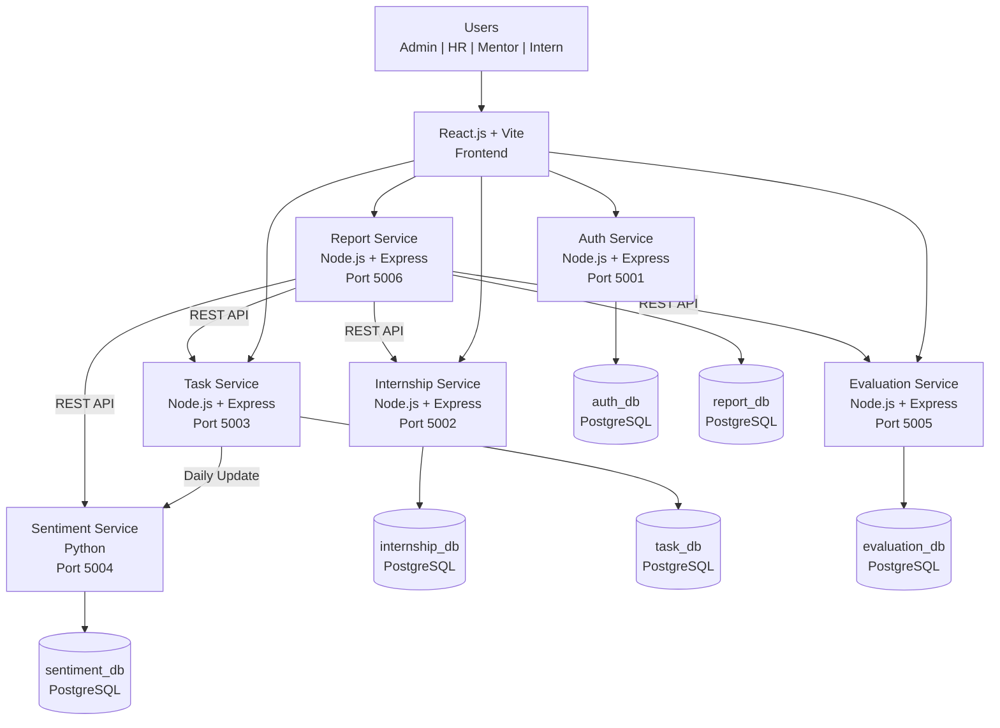

---

# 🔧 Microservices

The backend consists of six major services.

| Service | Port | Responsibility |
|---|---:|---|
| Auth Service | 5001 | Authentication and authorization |
| Internship Service | 5002 | Internship management |
| Task Service | 5003 | Tasks and daily updates |
| Sentiment Service | 5004 | Sentiment analysis |
| Evaluation Service | 5005 | Mentor evaluation and scoring |
| Report Service | 5006 | Monthly performance reports |

Each service is independently developed and communicates through APIs.

---

# 🗄️ Database Architecture

The system uses separate PostgreSQL databases for individual services.

| Database | Service |
|---|---|
| `auth_db` | Auth Service |
| `internship_db` | Internship Service |
| `task_db` | Task Service |
| `sentiment_db` | Sentiment Service |
| `evaluation_db` | Evaluation Service |
| `report_db` | Report Service |

### Database Principle

```text
Auth Service        → auth_db
Internship Service  → internship_db
Task Service        → task_db
Sentiment Service   → sentiment_db
Evaluation Service  → evaluation_db
Report Service      → report_db
```

Services should not directly access another service's database.

---

# 📂 Project Structure

```text
InternshipManagement/
│
├── Backend/
│   │
│   ├── database/
│   │   ├── auth_db.sql
│   │   ├── internship_db.sql
│   │   ├── task_db.sql
│   │   ├── sentiment_db.sql
│   │   ├── evaluation_db.sql
│   │   └── report_db.sql
│   │
│   ├── scripts/
│   │   ├── Start-Services.ps1
│   │   └── Test-Services.ps1
│   │
│   ├── shared/
│   │   ├── auth.js
│   │   └── database.js
│   │
│   └── services/
│       │
│       ├── auth-service/
│       │   ├── config/
│       │   ├── controllers/
│       │   ├── middleware/
│       │   ├── routes/
│       │   ├── server.js
│       │   └── package.json
│       │
│       ├── internship-service/
│       │   ├── config/
│       │   ├── controllers/
│       │   ├── routes/
│       │   ├── server.js
│       │   └── package.json
│       │
│       ├── task-service/
│       │   ├── server.js
│       │   └── package.json
│       │
│       ├── sentiment-service/
│       │   ├── app.py
│       │   ├── server.js
│       │   ├── requirements.txt
│       │   └── package.json
│       │
│       ├── evaluation-service/
│       │   ├── server.js
│       │   └── package.json
│       │
│       └── report-service/
│           ├── server.js
│           └── package.json
│
├── Frontend/
│   └── Frontend/
│       ├── public/
│       ├── src/
│       │   ├── components/
│       │   ├── context/
│       │   ├── pages/
│       │   ├── services/
│       │   ├── App.jsx
│       │   ├── App.css
│       │   └── main.jsx
│       ├── package.json
│       └── vite.config.js
│
└── README.md
```

---

# 🔄 System Workflow

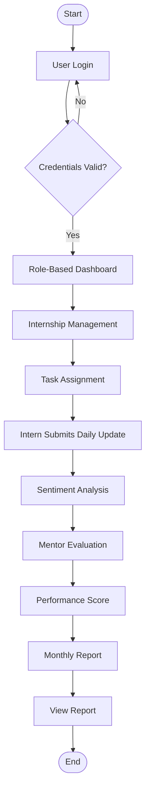

---

# 👤 Use Case Diagram

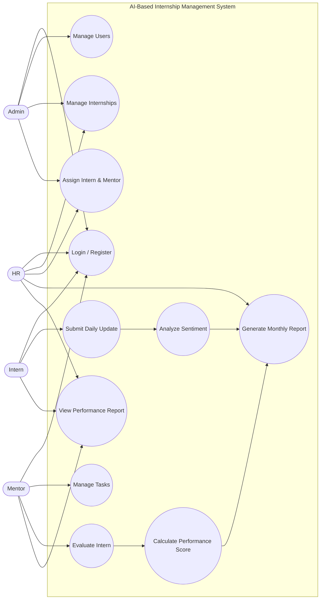

---

# 📊 DFD Level 0

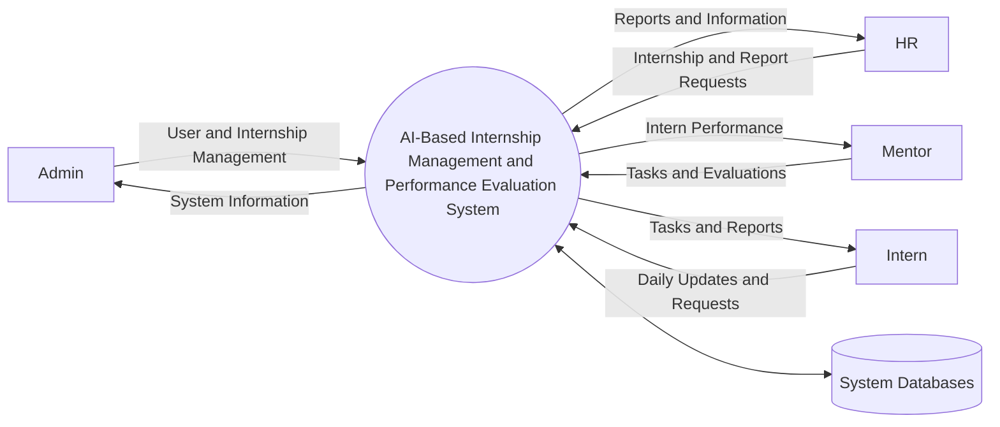

---

# 📊 DFD Level 1

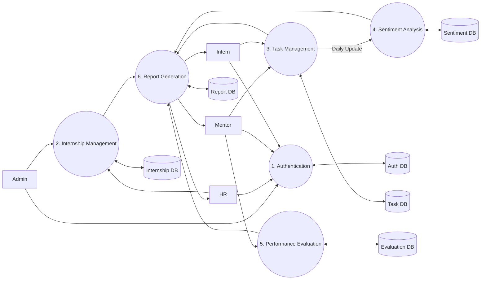

---

# 🗃️ ER Diagram

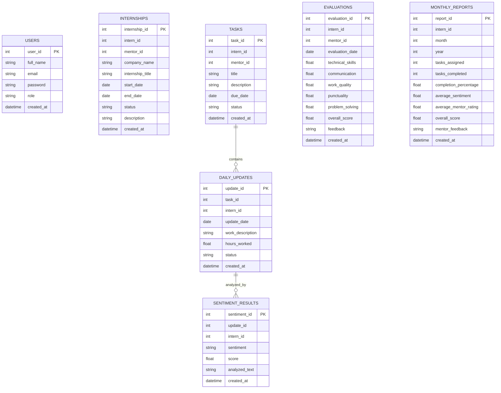

> Note: The microservices use separate databases. IDs such as `intern_id` and `mentor_id` can represent application-level references rather than cross-database foreign keys.

---

# 🔐 Login Sequence Diagram

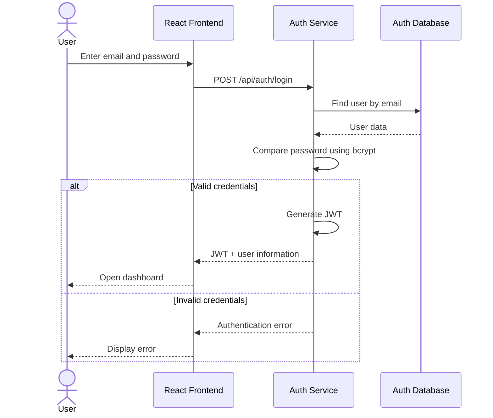

---

# 🤖 Daily Update and Sentiment Analysis

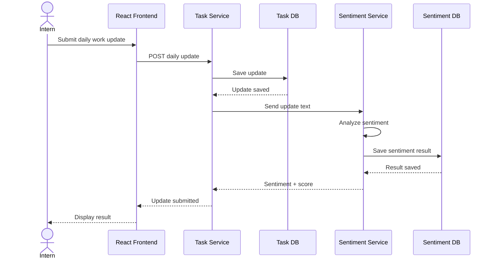

---

# 📈 Mentor Evaluation Sequence

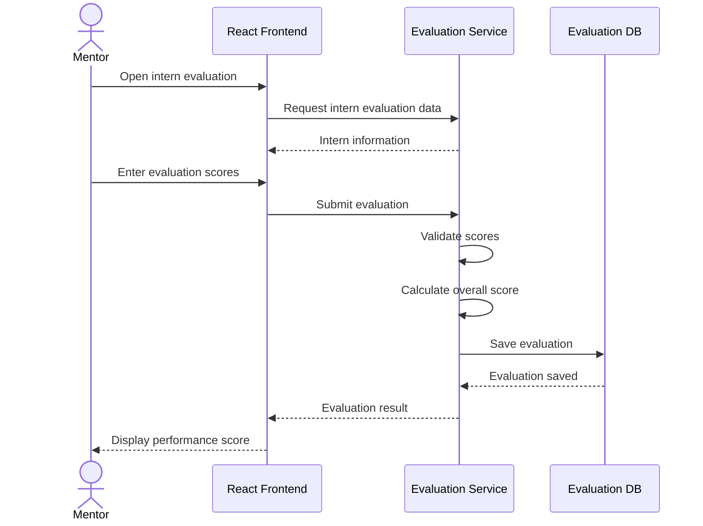

---

# 📊 Monthly Report Generation

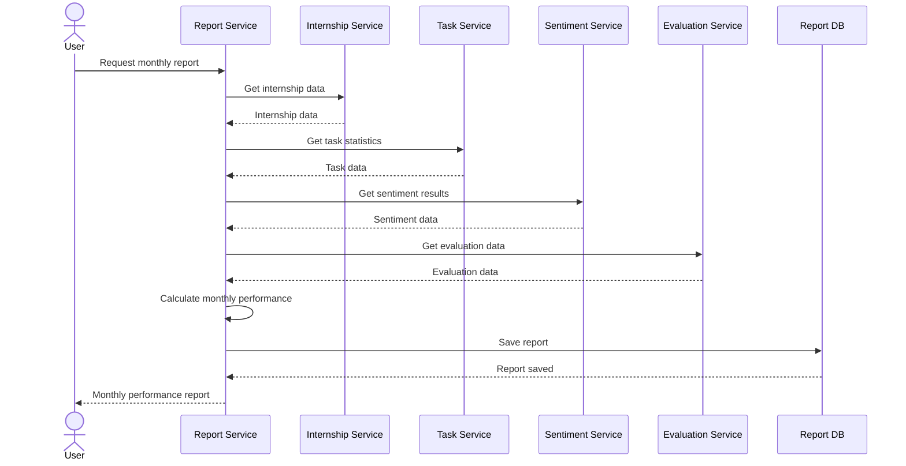

---

# 🔄 Activity Diagram

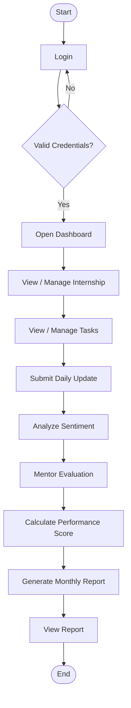

---

# 🖥️ Deployment Diagram

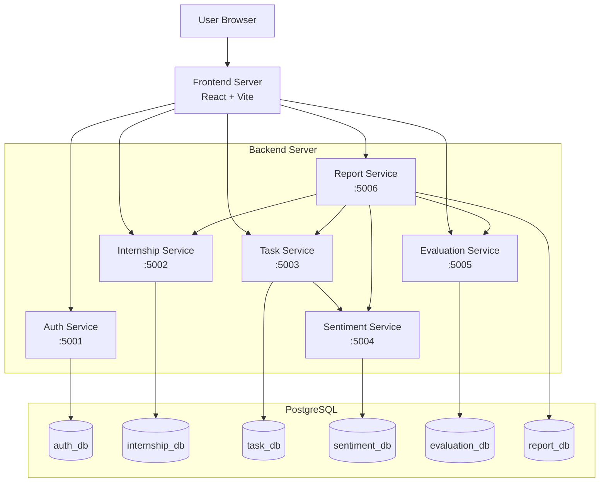

---

# 🔐 Authentication

Authentication is handled by the Auth Service.

### Registration

```http
POST /api/auth/register
```

### Login

```http
POST /api/auth/login
```

After successful login, the Auth Service generates a JWT token.

Protected endpoints use:

```http
Authorization: Bearer <JWT_TOKEN>
```

Passwords are hashed using bcrypt before being stored.

---

# 🤖 Sentiment Analysis

The Sentiment Service analyzes the text submitted by interns in their daily work updates.

Example:

```text
Today I successfully completed my assigned task.
```

Possible sentiment results:

```text
POSITIVE
NEUTRAL
NEGATIVE
```

The service also produces a sentiment score.

---

# 📊 Performance Evaluation

Mentors evaluate interns using multiple dimensions:

- Technical Skills
- Communication
- Work Quality
- Punctuality
- Problem Solving

The Evaluation Service calculates the overall performance score based on the configured scoring logic.

---

# 📑 Monthly Reports

The Report Service collects information from different services and generates monthly performance information.

Reports can contain:

- Tasks assigned
- Tasks completed
- Completion percentage
- Sentiment information
- Mentor evaluation
- Overall performance score
- Mentor feedback

---

# 🔌 API Endpoints

## Auth Service

```text
POST /api/auth/register
POST /api/auth/login
```

Protected endpoints require:

```text
Authorization: Bearer <JWT_TOKEN>
```

Additional service endpoints are documented in:

```text
Backend/API.md
```

---

# ⚙️ Environment Variables

Each service contains an `.env.example` file.

Create a `.env` file for each service.

Example:

```env
PORT=5001

DB_HOST=localhost
DB_PORT=5432
DB_NAME=auth_db
DB_USER=postgres
DB_PASSWORD=your_password

JWT_SECRET=your_secret_key
```

### Important

Never commit real `.env` files.

Do not expose:

```text
DB_PASSWORD
JWT_SECRET
API_KEYS
```

---

# 🚀 Installation

## 1. Clone Repository

```bash
git clone <YOUR-GITHUB-REPOSITORY-URL>
cd InternshipManagement
```

---

# Backend Setup

Install dependencies for each service.

### Auth Service

```bash
cd Backend/services/auth-service
npm install
```

### Internship Service

```bash
cd ../internship-service
npm install
```

### Task Service

```bash
cd ../task-service
npm install
```

### Evaluation Service

```bash
cd ../evaluation-service
npm install
```

### Report Service

```bash
cd ../report-service
npm install
```

### Sentiment Service

```bash
cd ../sentiment-service
npm install
pip install -r requirements.txt
```

---

# 🗃️ Database Setup

Create the PostgreSQL databases:

```text
auth_db
internship_db
task_db
sentiment_db
evaluation_db
report_db
```

SQL scripts are available in:

```text
Backend/database/
```

Execute the corresponding SQL file for each database.

---

# ▶️ Running the Backend

Each microservice can be started independently.

Example:

```bash
cd Backend/services/auth-service
npm run dev
```

or:

```bash
node server.js
```

Repeat the process for the remaining services.

The project also contains:

```text
Backend/scripts/Start-Services.ps1
Backend/scripts/Test-Services.ps1
```

---

# 💻 Running the Frontend

```bash
cd Frontend/Frontend
npm install
npm run dev
```

The frontend normally runs at:

```text
http://localhost:5173
```

---

# 🧪 Testing

Postman can be used to test the REST APIs.

Example:

```http
POST http://localhost:5001/api/auth/register
```

Login:

```http
POST http://localhost:5001/api/auth/login
```

Protected request:

```http
Authorization: Bearer <JWT_TOKEN>
```

---

# 🔄 Git Workflow

Get latest changes:

```bash
git pull origin main
```

Check changes:

```bash
git status
```

Add changes:

```bash
git add .
```

Commit:

```bash
git commit -m "Update project"
```

Push:

```bash
git push origin main
```

---

# 📌 Future Enhancements

- Email notifications
- Automated reminders
- PDF report generation
- Excel report generation
- Advanced sentiment analysis
- Attendance management
- Mentor-intern communication
- Docker deployment
- Cloud deployment
- Automated scheduled reports

---

# 🎓 Project Information

| Property | Details |
|---|---|
| **Project** | AI-Based Internship Management and Performance Evaluation System |
| **Architecture** | Microservices |
| **Frontend** | React.js + Vite |
| **Backend** | Node.js + Express.js |
| **AI Component** | Python Sentiment Analysis |
| **Database** | PostgreSQL |
| **Authentication** | JWT + bcrypt |
| **API** | REST API |
| **Purpose** | Academic Project |

---

# 👨‍💻 Developed For

**MSc Computer Applications**

---

## ⭐ Project Summary

The system combines **internship management, task tracking, AI-based sentiment analysis, mentor evaluation, and performance reporting** into a single platform.

The microservices architecture provides separation of responsibilities, independent database ownership, and scalable backend services.

---
